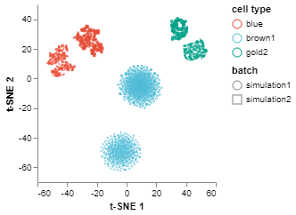
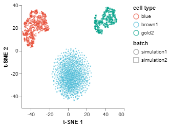

# Performing Batch Correction and Integration using FEATS

In this code example, we describe how to perform batch correction and integration using FEATS. We will use an artificial dataset, however, the same steps can be followed for any dataset.

## Import libraries

Firstly, we need to import libraries to enable us to use the modules. For batch correction, we import `CorrectBatches` which is going to perform correction or allignment, and `IntegrateBatches` which is going to find common genes among the datasets and combine/merge all the datasets into one. For more information on these functions please use `help()` command by passing the function name as the argument, e.g., `help(IntegrateBatches)`.

```python
# Import core libraries
import pandas as pd

# Import our libraries
from singlecelldata import SingleCell
from feats import CorrectBatches, IntegrateBatches

# Visualization
from scplotlib import tSNEPlot
```

## Import datasets

The second step is to import the datasets into the notebook environment. To do this we will use the Pandas `read_csv` function to read the data from csv format files into dataframes. Here we have two batches, batch1 and batch2. Apart from the gene expression matrix we will also import cell data which consists of the cell type information. Note that cell type information is arbitrarily used here.

```python
# Import Data

batch1 = pd.read_csv("data/batch1.csv", index_col=0)
batch2 = pd.read_csv("data/batch2ii.csv", index_col=0)

b1_celldata = pd.read_csv("data/batch1_labels.csv", index_col=0)
b1_celldata = pd.DataFrame(b1_celldata.values, columns = ["cell type"])

b2_celldata = pd.read_csv("data/batch2ii_labels.csv", index_col=0)
b2_celldata = b2_celldata.T
b2_celldata = pd.DataFrame(b2_celldata.values, columns = ["cell type"])
```

## Create SingleCell objects from the data

Next, we will create SingleCell objects from the data using the `SingleCell` class. Note here that we are only passing the data and  the celldata dataframes into the class constructor. We are not passing any genedata dataframe. The constructor will automatically create a genedata dataframe and store gene names as 'gene1', 'gene2', ..., 'gened' under the data column 'gene_names'. We can call the `print()` method to see a summary of the SingleCell object.

```python
# Create a single cell object  

bat1 = SingleCell(dataset = "simulation1", data = batch1, celldata = b1_celldata)
bat2 = SingleCell(dataset = "simulation2", data = batch2, celldata = b2_celldata)

bat2.print()
```

    ------------------------------------------------------------------------------
    Dataset:  simulation2
    ------------------------------------------------------------------------------
    Dimension:  (100, 1000)
    Cell Metadata:  ['cell type']
    Gene Metadata:  ['gene_names']
    ------------------------------------------------------------------------------
    

## Create a list of batches

To do batch integration, we have to create a Python list of batches.

```python
# Create a list of all the batches

batches = [bat1, bat2]
```

## Integrate and merge the batches

The next step is to find common genes across the batches before merging them all into one dataset. The datasets can have different number and type of genes and cells. The `IntegrateBatches` function will attempt to find common genes across the datasets and merge the datasets into one SingleCell object. If no common genes are found a message will be displayed and the function will exit. We need to pass the batches list into this function as the first argument. The second argument is the name of the data column which stores the gene names in the SingleCell object. This needs to be passed as alist of string with the length same as the number of datasets as each dataset can store the gene name information under different names. We can also call `print()` on the integrated dataset to see a summary. We can see that another data column, 'batch', has been added to cell metadata to include batch information.

```python
# Integrate batches and merge into 1 SingleCell dataset

batches = IntegrateBatches(batches, name_by = ['gene_names', 'gene_names'])
```

    Integrating Batches . . .
    Number of common genes in all batches:  100
    Merging Batches . . .
    

```python
batches.print()
```

    ------------------------------------------------------------------------------
    Dataset:  simulation1+simulation2
    ------------------------------------------------------------------------------
    Dimension:  (100, 2000)
    Cell Metadata:  ['cell type' 'batch']
    Gene Metadata:  ['gene_names']
    ------------------------------------------------------------------------------
    

## Visualise batches before correction/alignment

We can visualize the integrated datasets before performation correction. We use the `tSNEPlot` function to generate a 2D scatter plot. We can see that the same cell types in different batches do not appear together or are not aligned.

```python
fig1 = tSNEPlot(batches,
                marker_by = 'batch',
                color_by = 'cell type',
                tsne_init = 'pca')
fig1.show()
```



## Run batch correction

To run batch correction, we use the `CorrectBatches` function. The first argument is the integrated batches as one SingleCell object. The second argument is `correct_order`, were the user can specify the order of the batches to use for correction. The `CorrectBatches` function will assign the first batch in the list as the reference batch and the second as the target batch. It will correct two batches at a time, and merge the first two to be used as the reference batch for correcting the third batch and so on. In this case, we only have two batches, so 'simulation1' will be the reference batch and 'simulation2' will be the target batch. The next parameter is the `sigma` parameter for the Gaussian kernel which is used to smooth correction vectors. The last parameter is `svd_dim`, the number of eigenvectors to select for checking the orthogonality assumption in MNN batch correction. For more info, run `help(CorrectBatches)`.

```python
batches = CorrectBatches(batches,
                         correct_order = ['simulation1', 'simulation2'], 
                         sigma = 10,
                         svd_dim = 2)
```

    Correcting batches < simulation1  and  simulation2 >
    Merging Batches . . .
    

## Visualize corrected/aligned batches

Finally, we can do `tSNEPlot` again to visualize the corrected batches.

```python
fig2 = tSNEPlot(batches,
                color_by = 'cell type',
                marker_by = 'batch',
                tsne_init = 'pca')
fig2.show()
```


