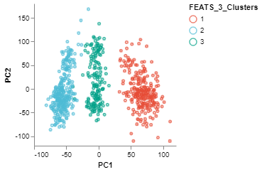
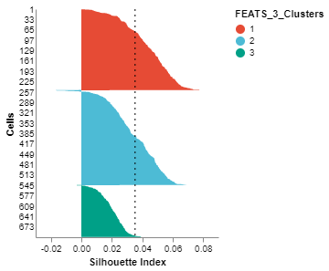
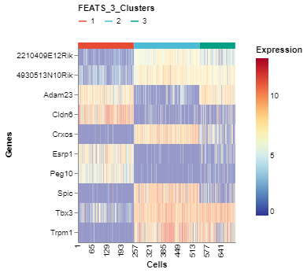
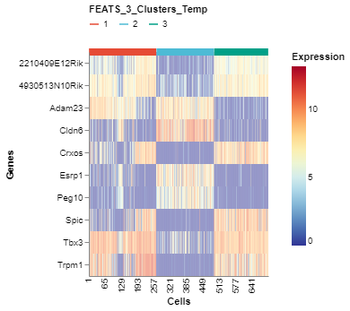

# Performing Clustering using FEATS

This notebook shows how to perform clustering using the FEATS package.

## Import libraries

The first step is to import libraries including functions from the FEATS package. We use the `json` package to load a python dictionary of dataset specific parameters stored as a text file. The `pandas` package is used to open data files stored as csv and to create dataframes. The `adjusted_rand_score` function from the scikit-learn package is used for computing ARI. The `SingleCell` class from the [singlecelldata](https://github.com/edwinv87/singlecell) package is used for easy management of single-cell datasets. The functions in FEATS pcakage accepts SingleCell objects only to perform analysis. Plotting functions from the [scplotlib](https://github.com/edwinv87/scplotlib) library are used to generate cluster visualizations. The Cluster function from FEATS package is used to perform clustering.

```python
# Import core libraries
import json
import pandas as pd
from sklearn.metrics.cluster import adjusted_rand_score

# Import SingleCell
from singlecelldata import SingleCell

# Import visualization functions
from scplotlib import PCAPlot, SilhouettePlot, GeneExpHeatmap

# Import the FEATS methods
from feats import Cluster, GeneFilter, LogFilter

```

## Load dataset

The next step is to load the dataset. Here we use Pandas to import data stored in csv format into dataframes. The dataframes are then used to create the SingleCell object as the functions in the FEATS package accepts SingleCell objects.

```python
# Python dictionary storing dataset specific parameters.
dataset_params = json.load(open("dset_param.txt"))

dataset = "kolodziejczyk"
dset_name = dataset_params[dataset]['dset_name']
data_path = "../../New_Datasets/" + dset_name + '/' + dset_name + "_data.csv"
celldata_path = "../../New_Datasets/" + dset_name + '/' + dset_name + "_celldata.csv"
genedata_path = "../../New_Datasets/" + dset_name + '/' + dset_name + "_genedata.csv"

data = pd.read_csv(data_path, index_col=0)
celldata = pd.read_csv(celldata_path, index_col=0)
genedata = pd.read_csv(genedata_path, index_col = 0)

# Create a single cell object
sc = SingleCell(dataset,data,celldata,genedata)

# Get parameters from the dictionary
label = dataset_params[dataset]['label'] # This is the name of the
                                         # column which stores true cell labels.
nc = dataset_params[dataset]['nc'] # This is the true number of
                                   # clusters in the dataset.

# sc.print()
```

## Log transformation

The LogFilter function takes the Log (with base 2) of the expression counts stored in sc and stores the log transformed values in the data assay.

```python
# Take a log transformation of gene expressions
sc = LogFilter(sc)
```

## Gene filtering

The GeneFilter function filters out genes based on the filtering criteria. It accepts three arguments apart from the sc object which are `min_cells`, `max_cells` and `expr_thres`. The GeneFilter function filters out genes expressed (with expression value less than or equal to `expr_thres`) in less than `min_cells` and greater than `max_cells` number of cells. Here we use 10% of cells as the `min_cells` and 90% of cells as `max_cells`. `expr_thres` is 0 by default.

```python
# Perform Gene Filtering
sc = GeneFilter(sc,
                min_cells = int((10/100) * sc.dim[1]),
                max_cells = int((90/100) * sc.dim[1]),
                expr_thres = 0)
```

    Applying Gene Filter . . .
    Number of features remaining after gene filtering:  10725
    

## Clustering

The Cluster function from FEATS is used to cluster the cells in the dataset. The first argument is the SingleCell object. The second argument is the number of clusters in the data `n_clusters`. Since we know this for this dataset, we pass the true number of clusters, `nc`. This parameter also accepts a python list of integers as number of clusters. Clustering will be performed using all the integers in the list. It also accepts the string `'gap'`, in which case it will estimate the number of clusters using gap statistic. The output argument is the SingleCell object which stores the computed clusters and other information. The second output argument is the number of clusters in the data (which we don't need in this case).

```python
# Perform clustering
sc, _ = Cluster(sc, k = nc)
```

    Computing Temporary Clusters . . .
    Performing Feature Selection . . .
    Computing 3 clusters using best features . . .
    Saving final cluster labels in Single Cell object . . .
    

## Adjusted rand index

We can assess the clustering performance by computing the ARI using `adjusted_rand_score` function from scikit-learn package. The sc object stores the true cluster labels. We can get a numeric version of the true cell labels using the function `getNumericCellLabels` if it is stored as a string or in any other form. The FEATS clustering also stores the computed cluster labels in the celldata assay under the column name `FEATS_k_Clusters`, where `k` is the number of clusters. 

```python
# Compute and print the Adjusted Rand Score
print ("Adjusted Rand Index: ")
print (adjusted_rand_score(sc.getNumericCellLabels(label), sc.getCellData("FEATS_3_Clusters")))
```

    Adjusted Rand Index: 
    0.9919841315168355
    

## Visualize the clusters formed

We can visualize the clusters formed using FEATS in various ways. (1) We can do a PCA plot which is a scatter plot in 2D after reducing the dimensionality using PCA. The scatter plot can be colored using the `color_by` argument. We color the plot according to clusters computed by FEATS (fig1). (2) We can do a silhouette plot which will show the silhouette scores of the samples in each cluster (sorted by cluster and silhouette score). We have to specify the cluster information using the `cluster_by` argument. Silhouette score is a measure of how similar cells are to their own cluster compared to other clusters. The silhouette values are in the range $[-1, 1]$. Values closer to 1 indicate that samples are well matched to their own cluster and poorly matched to neighbouring clusters (fig2).

```python
fig1 = PCAPlot(sc,
               color_by = "FEATS_3_Clusters",
               marker_size = 10,
               marker_thickness = 2)
fig1.show()
```



```python
fig2 = SilhouettePlot(sc, cluster_by = "FEATS_3_Clusters")
fig2.show()
```



## High scoring genes (Top genes)

We can visualize the top genes according to their F-scores. To do this, we can generate a heatmap of the genes sorted by the F-scores using the `GeneExpHeatmap` function from scplotlib package (fig3). Cells can be sorted according to their clusters with a horizontal colored bar on top of the heatmap indicating the cluster. The `color_by` argument is used to do this. The genes can be sorted also using the `sort_by` argument. We use the F-scores stored in the sc object after performing FEATS clustering. The F-scores are stored under the column `FEATS_F_Score` in the genedata assay. We can also point to the column which stores the gene names using the `name_by` argument. In this case the column `feature_symbol` stores the gene names in the genedata assay. In addition, we can specify the number of genes we want using the `top_num_genes` argument. We can also generate the heatmap where cells are sorted according to the temporary clusters computed by FEATS (fig4). The temporary clusters are computed to perform ANOVA.

```python
# Plot top expressions
fig3 = GeneExpHeatmap(sc,
                      color_by = 'FEATS_3_Clusters',
                      sort_by = 'FEATS_F_Score',
                      name_by =  'feature_symbol',
                      top_num_genes = 10)
fig3.show()
```



```python
fig4 = GeneExpHeatmap(sc,
                      color_by = 'FEATS_3_Clusters_Temp',
                      sort_by = 'FEATS_F_Score',
                      name_by =  'feature_symbol',
                      top_num_genes = 10)
fig4.show()
```



### Contact

For clarification on any of the functions used in this document please contact us via email: vans.edw@gmail.com
