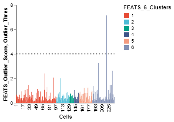
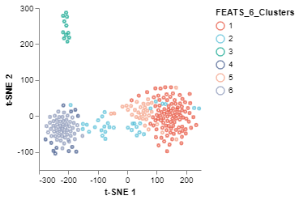
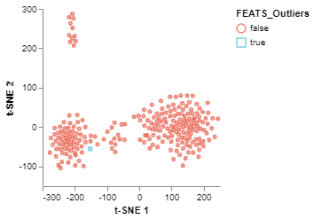

# FEATS Outlier Analysis

In this notebook, we perform outlier analysis using FEATS on [mouse intestine dataset](https://www.nature.com/articles/nature07935).

## Import libraries

The first step is to import the Python libraries for performing the analysis.

```python
# Import core libraries
import numpy as np
import pandas as pd

import json

# Import our libraries
from singlecelldata import SingleCell
from feats import DetectOutliers, Cluster


# Import Plotting Functions
from scplotlib import tSNEPlot, PlotOutlierScores
```

## Load data

The next step is to load the data into this notebook environment.

```python
# Python dictionary storing dataset specific parameters.
dataset_params = json.load(open("dset_param.txt"))

dataset = "intestine"
dset_name = dataset_params[dataset]['dset_name']

path = "datasets/"
data_path = path + dset_name + '/' + dset_name + "_data.csv"
celldata_path = path + dset_name + '/' + dset_name + "_celldata.csv"
genedata_path = path + dset_name + '/' + dset_name + "_genedata.csv"

data = pd.read_csv(data_path, index_col=0)
celldata = pd.read_csv(celldata_path, index_col=0)
genedata = pd.read_csv(genedata_path, index_col = 0)

# Create a single cell object
sc = SingleCell(dataset,data,celldata,genedata)

# Get parameters from the dictionary
label = dataset_params[dataset]['label']
nc = dataset_params[dataset]['nc']

# sc.print()
```

## Perform clustering

Clustering is performed prior to performing outlier analysis. We use the FEATS `Cluster` function and specify the number of clusters using the `k` parameter. We apply the cosine normalization on the data and use the full gene space to search for the optimal number of top genes/features. For more information on the `Cluster` function run `help(Cluster)`.

```python
# Perform clustering
sc, _ = Cluster(
    sc,
    k = nc,
    normalization = 'cosine',
    q = np.arange(1, sc.dim[0] + 1)
    )
```

    Computing Temporary Clusters . . .
    Performing Feature Selection . . .
    Computing 6 clusters using best features . . .
    Saving final cluster labels in Single Cell object . . .
    

## Perform outlier detection

After clustering, we can call the `DetectOutliers` function to compute outliers. We have to provide the cluster information using the `cluster_label` argument. We use 'FEATS_6_Clusters', which is the column under which FEATS stores the computed cluster label information. We select the reduced dimensionality, `red_dim` as 2 and the probability threshold for outliers `outlier_prob_thres` as $10^{-4}$.

```python
sc = DetectOutliers(sc,
                    cluster_label = 'FEATS_6_Clusters',
                    red_dim = 2,
                    outlier_prob_thres = 10**-4)
```

    Computing outliers . . .
    Number of outliers =  1
    Number of points in out of sample =  11
    Saving outlier information in Single Cell object . . .
    

## Visualization

Using functions from the [scplotlib](https://github.com/edwinv87/scplotlib) library, we can visualize the outputs of the outlier detection method stored in the SingleCell object. The FEATS outlier detection function saves various parameters such as outlier scores, whether or not a cell is an outlier, etc., in the celldata assay of the SingleCell object. Run `help(DetectOutliers)` for more information. We can use these parameters to generate visualization. The `PlotOutlierScores` function generates a vertical bar plot of the outlier scores for each cell (fig1). You have to specify the name of the column which stores the outlier scores using the `outlier_score` argument. Additionally, we can also color the bars for different cell types using the `color_by` argument and plot a threshold line using the `threshold` argument. We have to specify the data column which stores these parameters. For other arguments see [scplotlib](https://github.com/edwinv87/scplotlib) documentation.

The `tSNEPlot` function of the scplotlib can be used to generate two dimensional scatter plot. This function reduces the dimensionality via tSNE using tSNE parameters (arguments which start using the `tsne_` prefix). The `tSNEPlot` function has been used to generate a 2D scatter plot (fig2) by coloring the data points using cluster labels generated by FEATS ('FEATS_6_Clusters'). We can also show which samples are outliers by specifying the marker color (`color_by`) and shape (`shape_by`) arguments (fig3). Here we show which samples are outliers by specifying 'FEATS_outliers' for those arguments.

```python
fig1 = PlotOutlierScores(sc,
                         outlier_score = 'FEATS_Outlier_Score',
                         color_by = 'FEATS_6_Clusters',
                         threshold = 'Outlier_Thres',
                         height = 200,
                         width = 200)
fig1.show()
```



```python
fig2 = tSNEPlot(sc,
                color_by = 'FEATS_6_Clusters',
                tsne_iterations = 400,
                tsne_perplexity = 50,
                tsne_init = 'pca',
                tsne_random_state = 0,
                marker_size = 10,
                marker_thickness = 2)
fig2.show()
```



```python
fig3 = tSNEPlot(sc,
                color_by = 'FEATS_Outliers',
                marker_by = 'FEATS_Outliers',
                tsne_iterations = 400,
                tsne_random_state = 0,
                tsne_perplexity = 50,
                tsne_init = 'pca',
                marker_size = 10,
                marker_thickness = 2)
fig3.show()
```


